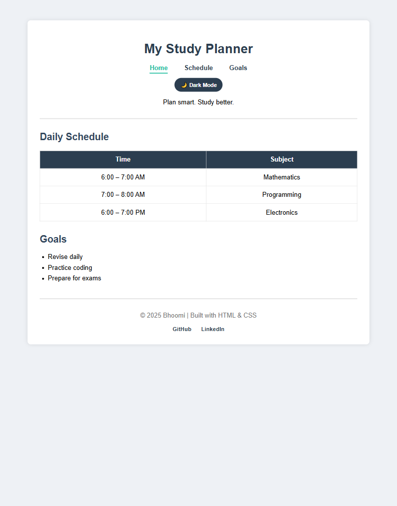
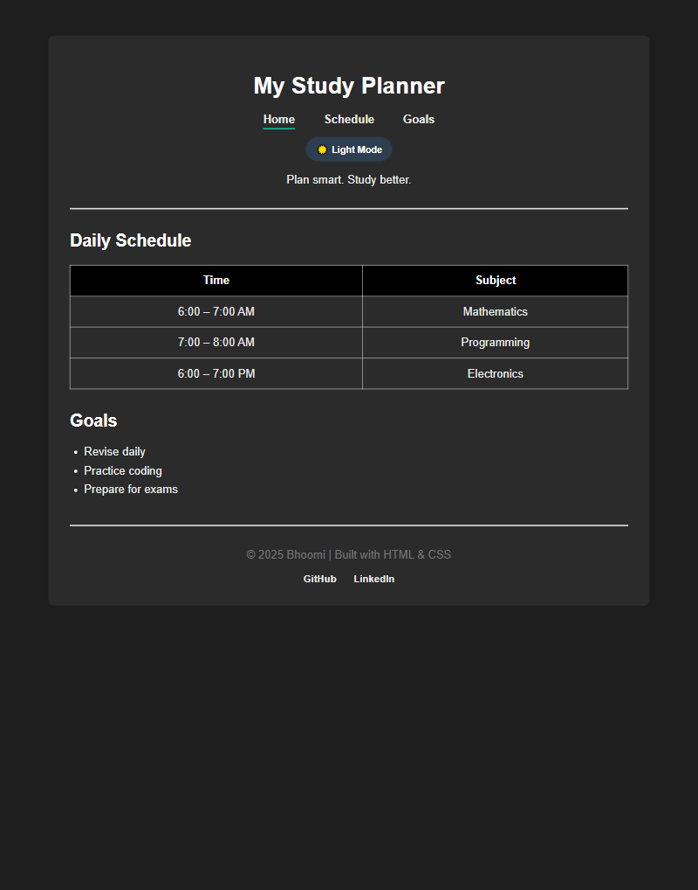

# 📘 Study Planner Website

A clean and responsive study planner website built using **HTML, CSS, and JavaScript**.  
It helps students organize their daily study schedule with a modern UI and dark mode support.

---

## 🔗 Live Demo
👉 https://bhoomiaggarwal31-code.github.io/STUDY-PLANNER/

---
## 📸 Screenshots

### Desktop View

### Mobile View

## ✨ Features
- 📅 Daily study schedule table  
- 🧭 Navigation bar with smooth scrolling  
- 🎨 Clean and modern UI  
- 🌙 Dark mode toggle (with preference saved)  
- 📱 Fully responsive (mobile & desktop)  

---

## 🛠️ Tech Stack
- **HTML5** – structure  
- **CSS3** – styling & responsiveness  
- **JavaScript** – dark mode toggle  
- **GitHub Pages** – hosting  

---

## 📂 Project Structure
├── index.html
├── css
│ └── style.css
assets/
│ │── web-page.jpeg
  │── light-mode.png
  └── dark-mode.png

---

## 🚀 What I Learned
- Structuring a real frontend project  
- Using external CSS properly  
- Responsive design with media queries  
- DOM manipulation with JavaScript  
- Hosting a live website using GitHub Pages  

---

## 👩‍💻 Author
**Bhoomi**  
- GitHub: https://github.com/bhoomiaggarwal31-code  
- LinkedIn: https://www.linkedin.com/in/bhoomi-aggarwal-b99729285/
  

